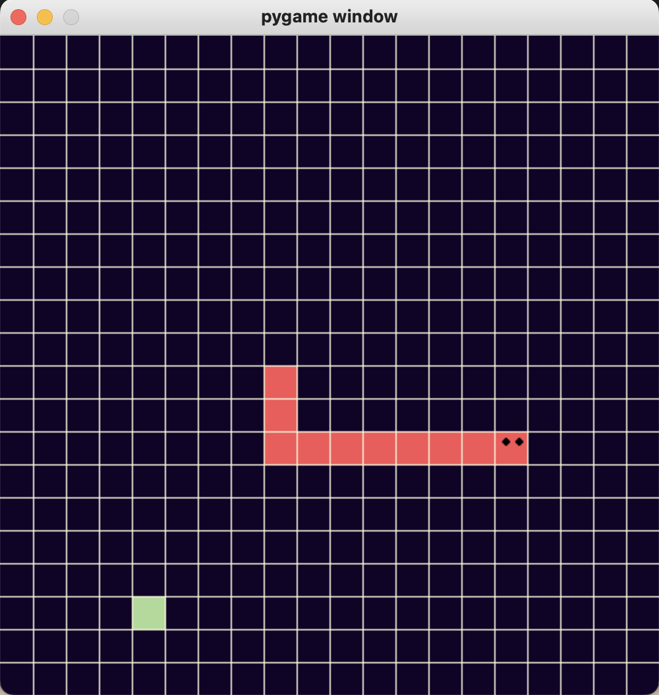

Some of the Python and Java problems I worked on...

## Snake, a pygame project

A 500x500 grid has a random cell with a green "snack," which, when hit by the snake object's face, causes the snake object to grow by one cell. The game ends when the snake head hits its own body. 

TODO:
- Show score and update score for each snack capture
- Add a challeging snack which stays for a short time, and when captured, provides an additional life

